<p align="center">
  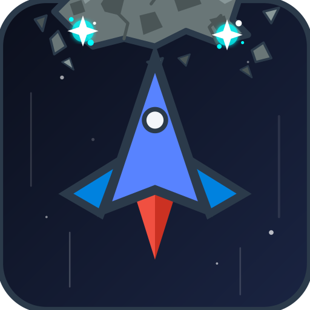
</p>

<h1 align="center">🚀 SPACE WARS</h1>

<p align="center">
  <strong>A retro arcade asteroid shooter reimagined for mobile.</strong><br/>
  Blast through waves of asteroids, dodge enemy fighters, collect power-ups, and face off against colossal dreadnought bosses — all while climbing the global leaderboard.
</p>

<p align="center">
  
  
  
  
  
  <a href="https://github.com/SparshMishra09/Astroid_Shooter/releases/latest"></a>
</p>

---

## 📖 Table of Contents

- [Overview](#overview)
- [Gameplay](#gameplay)
- [Features](#features)
- [Screenshots](#screenshots)
- [Tech Stack](#tech-stack)
- [Architecture](#architecture)
- [Getting Started](#getting-started)
- [Project Structure](#project-structure)
- [Firebase Setup](#firebase-setup)
- [Testing](#testing)
- [Roadmap](#roadmap)
- [License](#license)

---

## 📋 Overview

**Space Wars** is a vertically-scrolling arcade shooter built with Flutter. The player controls a spaceship at the bottom of the screen, dragging left and right to dodge debris while the ship auto-fires upward. The game features **two game modes** (Classic Run and Boss Rush), a wave-based difficulty curve, **six power-ups** with stacking rules, combo multipliers, and boss battles against **nine distinct boss variants**.

Every astrid (in-game currency) you earn is saved to your account via Firebase. Compete against other pilots on the global leaderboard plus per-mode boards — tracked by best score, highest wave/boss, asteroids destroyed, and bosses defeated.

### Target Audience
- Casual and mid-core mobile gamers who enjoy arcade shooters
- Fans of retro games like *Asteroids*, *Galaga*, and *Space Invaders*
- Players who enjoy progression systems and competitive leaderboards

---

## 🎮 Gameplay

### Core Loop
1. **Pick a mode** — Classic Run (waves) or Boss Rush (endless bosses)
2. **Drag** to move your ship horizontally
3. Your ship **auto-fires** bullets upward
4. **Destroy** asteroids and enemies to earn **astrids** (currency)
5. **Survive** waves — each wave gets harder with more enemies and faster spawns
6. **Collect** power-ups dropped by destroyed enemies
7. **Build combos** — consecutive hits without missing multiply your score
8. **Defeat bosses** — every 150 kills (Classic) or back-to-back (Boss Rush)
9. **Die** — your run ends, astrids are banked to your account, stats update on the leaderboard

### Game Modes

| Mode | Description |
|------|-------------|
| **Classic Run** | The original endless run — timed waves that grow harder, full enemy mix, a boss dreadnought every 150 kills. Enemy fighters join from wave 3. |
| **Boss Rush** | No asteroids, no waves — an endless gauntlet of bosses in random order (all 9 variants, equal odds), one at a time with a 10-second breather between kills. Power-ups drop on a timer; the laser is a rare jackpot find (~10% instead of 25%) so it can't trivialize boss fights. |

### Enemy Types

| Enemy | Appearance | HP | Astrids | Behavior |
|-------|-----------|-----|---------|----------|
| **Normal Asteroid** | Classic rocky SVG | 1 | 10 | Drifts downward, slow |
| **Small Fast Asteroid** | Glowing rocky shard | 1 | 15 | Fast, sharp, leaves a motion trail |
| **Huge Slow Asteroid** | Jagged rocky boulder | 3 | 30 | Tough — splits into 2 small asteroids when destroyed |
| **Enemy Fighter** | Evil-twin crimson ship | 1 | 40 | Moves horizontally, descends, fires downward |

### Boss Variants

| Boss | HP | Astrids | Attack Pattern |
|------|-----|---------|----------------|
| **Tri-Beam Dreadnought** | 50 | 200 | 3-way bullet spread — the Classic Run boss (every 150 kills) |
| **Rapid-Fire Boss** | 45 | 300 | Bullet hose — fast single shots straight down |
| **Penta-Beam Boss** | 60 | 400 | 5-way bullet spread |
| **Escort Carrier** | 70 | 500 | Single aimed shot + 3 enemy-fighter escorts |
| **Bulwark Sentinel** | 45 (+15 shield) | 350 | 15-hit energy shield must be broken first; fires 10-bullet bursts in one locked line at the player |
| **Void Lancer** | 55 | 450 | Freezes to charge (1s telegraph), then fires a vertical instant-kill laser — only an active shield survives it |
| **Demolition Titan** | 55 | 380 | Drops bomb barrels that fall to the player's level, then detonate in a blast radius |
| **Serpent Volley** | 50 | 360 | 7 bullets straight down in a V formation — the center arrives first, the wall snakes toward you |
| **Swarm Lords** | 10 units (2-hit shields) | 400 + 40/unit | Not one hull but ten shielded pods in two rows — each patrols, bobs, and fires aimed bullets; kill all ten to win |

*The last seven variants are Boss Rush exclusive.*

### Power-Ups

| Power-Up | Duration | Effect |
|----------|----------|--------|
| 🛡️ **Shield** | 10 sec | Absorbs one hit — also survives the Void Lancer's laser and absorbs bomb blasts |
| 🔴 **Rapid Fire** | 8 sec | Halves your shot interval — **stacks with Penta Shot** |
| 🟢 **Triple Shot** | 6 sec | Fires three bullets in a spread |
| 🟣 **Laser Beam** | 4 sec | Continuous vertical laser beam — rare drop in Boss Rush |
| 🩵 **Penta Shot** | 7 sec | 5 bullets in a locked "^" formation traveling straight up as one cluster at a slow cadence — replaces Triple Shot (last-equipped wins), stacks with Rapid Fire |
| 💚 **Wing Drones** | 9 sec | Two invulnerable companion ships flank you with constant rapid fire — rare drop in both modes |

### Combo System
- Every consecutive hit increases your combo multiplier (up to **3.0×**)
- Missing a shot or taking damage resets the combo
- Higher combos = more astrids per kill

### Wave System
- Each wave lasts **35–45 seconds** (longer at higher waves)
- Between waves, there's a **3-second break** with a possible bonus power-up drop
- Enemy variety ramps up:
  - **Wave 1**: Normal asteroids only
  - **Wave 2**: + Small fast asteroids
  - **Wave 3**: + Enemy fighters (low chance)
  - **Wave 4**: + Huge asteroids
  - **Wave 6+**: Everything, higher spawn rates

---

## ✨ Features

### 🎯 Core Game
- **Drag-to-move** controls with auto-fire — intuitive, one-thumb play
- **Two game modes** — Classic Run (wave-based) and Boss Rush (endless boss gauntlet)
- **4 enemy types** with unique behaviors and visuals
- **9 boss variants** with distinct attack patterns (shield domes, instant-kill lasers, bomb barrages, V-formations, a ten-unit swarm...)
- **6 power-ups** with stacking rules (Rapid Fire + Penta Shot combine; drones/shield/laser run independently)
- **Combo multiplier** system for skillful play
- **Boss battles** every 150 kills (Classic) or back-to-back (Boss Rush)
- **Haptic feedback** — heavy impact on laser activation, a double-tick celebration on every boss kill
- **Screen shake**, explosions, hit sparks, muzzle flashes, and engine trails
- **Animated parallax starfield** background

### 🔐 Authentication
- **Email/password** sign-up and login
- **Google Sign-In** with registered SHA-1 fingerprint
- **Space-themed auth UI** with animated starfield, glowing tab bar, and pulsing title
- **Per-user profiles** stored in Firestore

### 📊 Progression & Leaderboards
- **Astrids** — persistent currency accumulated across all games and modes (for future shop)
- **Global board** — Highest Astrids, across every mode
- **Per-mode boards** — Classic Run (Best Score / Highest Wave / Asteroids Destroyed) and Boss Rush (Best Score / Highest Boss / Bosses Defeated), each counting only that mode's games
- **Swipeable sections** — swipe between leaderboard sections or tap the chips; both inputs stay in sync
- **Real-time updates** — every board refreshes instantly when any player finishes a game
- **Legacy-friendly** — pre-mode-split stats carry over as Classic Run stats

### 🎨 Visual Design
- **Custom-painted entities** — enemy fighter, boss dreadnought, huge asteroid, and small asteroid are all rendered with detailed `CustomPainter` implementations (no sprite sheets)
- **Damage states** — enemies show cracks, smoke, and color shifts as they take damage
- **Particle effects** — explosions, hit sparks, muzzle flashes, collection bursts
- **Consistent space theme** across all screens (auth, home, game, leaderboard)

### 🛡️ Stability
- **Freeze-proof game loop** — deferred list mutation prevents `ConcurrentModificationError`, plus a try-catch safety net ensures the UI never permanently freezes
- **Atomic Firestore writes** — game results saved via transactions to prevent lost updates across devices
- **Graceful fallbacks** — Firestore failures fall back to local storage; missing profile fields default to zero

---

## 📸 Screenshots

<p align="center">
  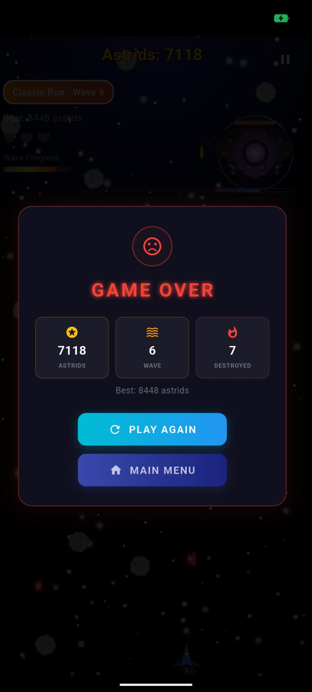
  &nbsp;&nbsp;
  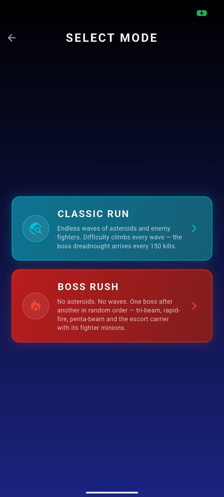
  &nbsp;&nbsp;
  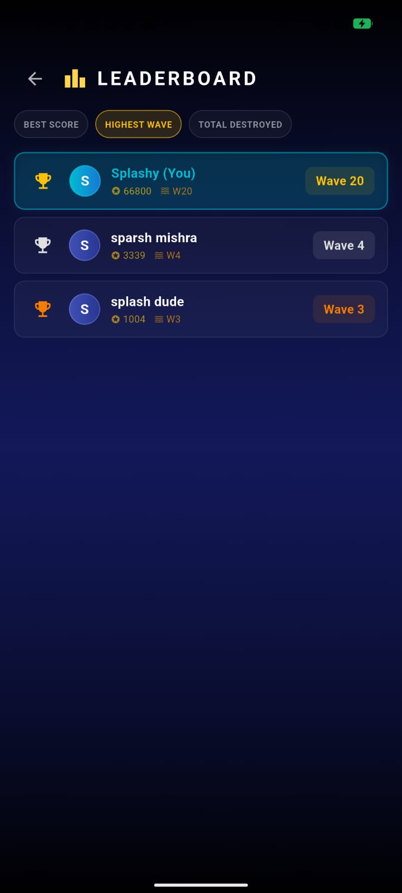
</p>

<p align="center">
  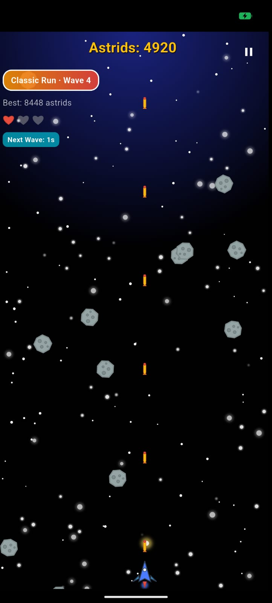
  &nbsp;&nbsp;
  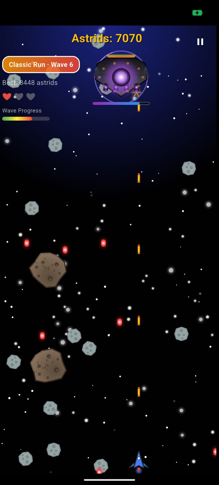
  &nbsp;&nbsp;
  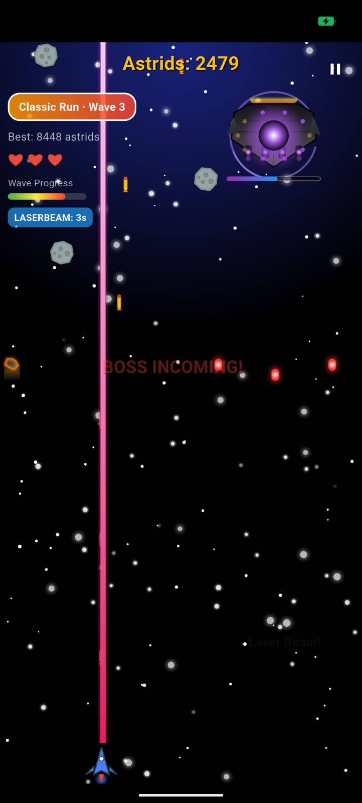
</p>

<p align="center">
  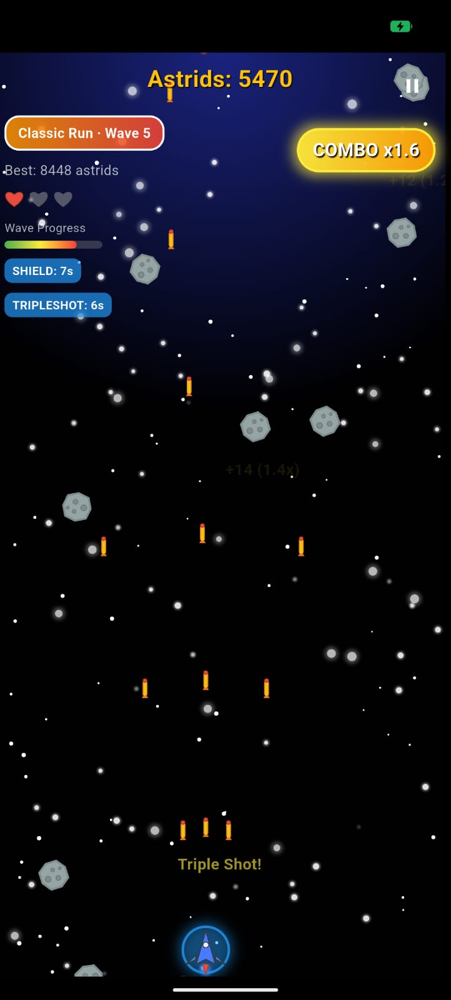
  &nbsp;&nbsp;
  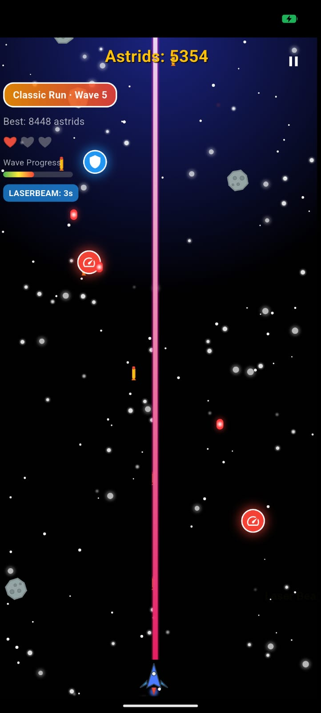
  &nbsp;&nbsp;
  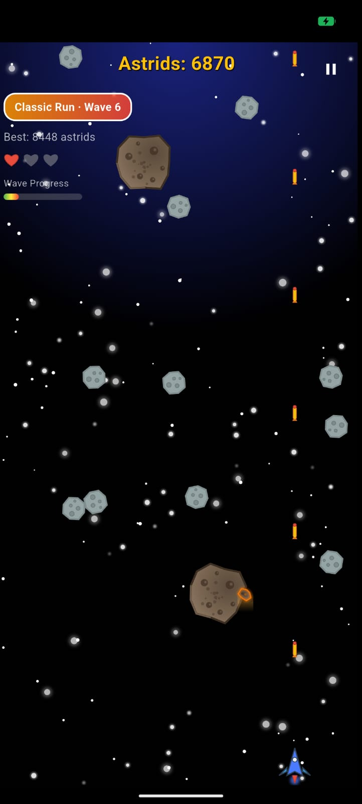
</p>

<p align="center">
  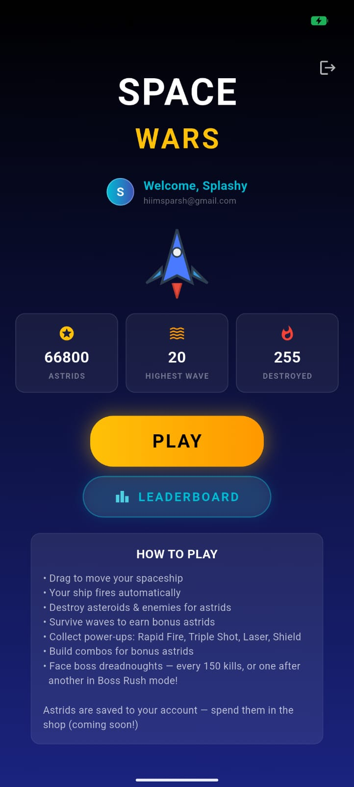
  &nbsp;&nbsp;
  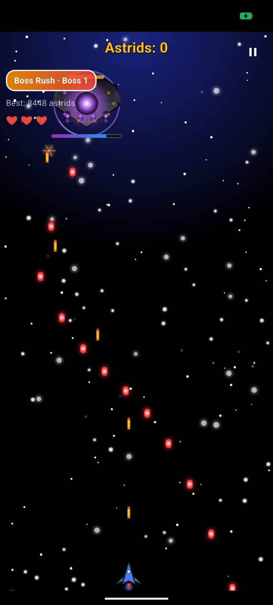
</p>

---

## 🛠️ Tech Stack

| Layer | Technology |
|-------|-----------|
| **Framework** | Flutter 3.41 (Dart 3.11) |
| **Rendering** | Custom `CustomPainter` + widget-based entity rendering |
| **State Management** | `StatefulWidget` + `GameController` (MVC separation) |
| **Backend** | Firebase (Auth + Cloud Firestore) |
| **Auth** | `firebase_auth` (email/password) + `google_sign_in` |
| **Database** | Cloud Firestore (user profiles, leaderboard) |
| **Local Storage** | `shared_preferences` (offline high-score fallback) |
| **Graphics** | `flutter_svg` (player ship, asteroids, hearts) + custom painters |
| **Audio** | `audioplayers` (background music + SFX) |
| **Architecture** | Strategy pattern for game modes, MVC for game logic |

---

## 🏗️ Architecture

Space Wars is built with a **scalable, modular architecture** designed for easy iteration and future game modes.

### Game Mode Strategy Pattern

```
GameModeConfig (abstract interface)
    ├── ClassicRunMode
    ├── BossRushMode
    └── [FutureMode] (add by implementing the interface + registering)
```

Each game mode implements `GameModeConfig`, which defines:
- Display name
- Whether power-ups / asteroids / waves / special enemies are enabled
- Shot interval logic (with power-up stacking)
- Power-up drop weights (per-mode rarity tuning)
- Asteroid and enemy spawn rates + probability tables
- Wave duration
- Boss spawn conditions, respawn cooldown, and which boss variants spawn
- Wave intro/notify text

**Adding a new game mode = one new file + one enum entry. No existing code changes.**

### MVC Separation

| Layer | Responsibility | Files |
|-------|---------------|-------|
| **Model** | Data classes for all game entities | `lib/models/` |
| **Controller** | All game logic (spawning, movement, collisions, scoring) | `lib/game/game_controller.dart` |
| **View** | Thin screen that owns the Timer, gestures, and widget tree | `lib/screens/game_screen.dart` |

The `GameScreen` was reduced from ~2,600 lines to ~450 lines by extracting all logic into `GameController`.

### Services Layer

| Service | Purpose |
|---------|---------|
| `AuthService` | Wraps Firebase Auth + Google Sign-In + Firestore profile creation |
| `UserProgressService` | Reads/writes per-user progress, submits game results via transactions, provides leaderboard streams |
| `ScoreService` | Local high-score storage (SharedPreferences fallback) |
| `AudioService` | Background music + sound effects |

### Freeze Prevention

The game loop uses a **deferred mutation pattern** to prevent `ConcurrentModificationError`:
- `splitHugeAsteroid()` adds split fragments to a `_pendingEnemies` buffer
- The buffer is flushed into the real `enemies` list **after** all iteration completes
- A try-catch safety net in the game loop ensures any exception is logged but never freezes the UI

---

## 🚀 Getting Started

### Prerequisites

- **Flutter SDK** 3.41+ ([install](https://docs.flutter.dev/get-started/install))
- **Dart SDK** 3.11+ (bundled with Flutter)
- **Android Studio** or **VS Code** with Flutter extension
- **Android SDK** (compileSdk 35+)
- A **Firebase project** (see [Firebase Setup](#firebase-setup))

### Installation

```bash
# Clone the repository
git clone https://github.com/SparshMishra09/Astroid_Shooter.git
cd Astroid_Shooter

# Install dependencies
flutter pub get

# Run in debug mode (connect a device or start an emulator)
flutter run

# Build a release APK
flutter build apk --release
```

The built APK will be at `build/app/outputs/flutter-apk/app-release.apk`.

---

## 📁 Project Structure

```
asteroid_shooter/
├── lib/
│   ├── main.dart                          # App entry point (Firebase init → AuthGate)
│   │
│   ├── auth/                              # Authentication layer
│   │   ├── auth_gate.dart                 # StreamBuilder routing (login ↔ home)
│   │   ├── auth_screen.dart               # Space-themed login/signup UI
│   │   └── auth_service.dart              # Firebase Auth + Google Sign-In wrapper
│   │
│   ├── config/                            # Tunable constants
│   │   ├── game_config.dart               # All gameplay constants (sizes, speeds, timings)
│   │   ├── palette.dart                   # Named color palettes for entities + UI
│   │   └── score_values.dart              # Base astrid values per enemy type
│   │
│   ├── game/                              # Game logic (strategy pattern)
│   │   ├── game_mode.dart                 # Abstract GameModeConfig interface
│   │   ├── classic_run_mode.dart          # Classic Run implementation
│   │   ├── boss_rush_mode.dart            # Boss Rush implementation (9-boss pool)
│   │   ├── game_mode_registry.dart        # Enum → config factory
│   │   └── game_controller.dart           # ALL game logic (spawn, move, collide, score)
│   │
│   ├── models/                            # Data models (no logic, no Flutter imports)
│   │   ├── enums.dart                     # GameMode, PowerUpType, EnemyType
│   │   ├── game_object.dart               # Base GameObject + collision
│   │   ├── player.dart                    # Player ship + combo system
│   │   ├── asteroids.dart                 # Asteroid, SmallFastAsteroid, HugeSlowAsteroid
│   │   ├── enemy_ship.dart                # EnemyShip (evil-twin fighter)
│   │   ├── swarm_unit.dart                # SwarmUnit (Swarm Lords boss encounter)
│   │   ├── boss.dart                      # Boss (dreadnought)
│   │   ├── projectiles.dart               # Bullet, EnemyBullet, LaserBeam
│   │   ├── power_ups.dart                 # PowerUp + ActivePowerUp
│   │   ├── effects.dart                   # Particle, Explosion, HitEffect, FloatingText
│   │   ├── game_state.dart                # Per-run state (score, waves, pause/gameover)
│   │   └── user_progress.dart             # Per-user persistent progress (Firestore)
│   │
│   ├── screens/                           # App screens
│   │   ├── home_screen.dart               # Stats, play button, leaderboard access
│   │   ├── mode_selection_screen.dart     # Game mode picker (Classic Run / Boss Rush)
│   │   ├── game_screen.dart               # Thin view: Timer + gestures + widget tree
│   │   └── leaderboard_screen.dart        # Global + per-mode real-time leaderboards
│   │
│   ├── services/                          # Backend services
│   │   ├── user_progress_service.dart     # Firestore progress + leaderboard
│   │   ├── score_service.dart             # Local high-score storage (fallback)
│   │   └── audio_service.dart             # Background music + SFX
│   │
│   └── widgets/                           # Reusable UI components
│       ├── space_background.dart          # Parallax starfield (CustomPaint, cached)
│       ├── entity_widgets.dart            # Positioned wrappers for all entities
│       ├── game_overlays.dart             # HUD, pause overlay, game over overlay
│       └── painters/                      # CustomPainter implementations
│           ├── enemy_ship_painter.dart     # Evil-twin fighter
│           ├── boss_painter.dart           # Dreadnought
│           ├── huge_asteroid_painter.dart  # Jagged rocky boulder
│           ├── small_asteroid_painter.dart # Sharp glowing shard
│           └── effects_painter.dart        # Explosions, sparks, muzzle flashes
│
├── assets/
│   ├── images/                            # SVGs (ship, asteroids, hearts) + logo
│   └── audio/                             # Background music + SFX
│
├── android/                               # Android-specific config
│   └── app/
│       ├── google-services.json           # Firebase config (gitignored)
│       └── src/main/res/mipmap-*/         # App launcher icons (generated from logo)
│
├── test/                                  # Flutter test suite
│   ├── freeze_regression_test.dart        # 7 tests for ConcurrentModificationError prevention
│   ├── game_flow_test.dart                # 10 tests for game + auth UI flow
│   ├── progress_test.dart                 # 7 tests for progress tracking + data model
│   └── widget_test.dart                   # 1 test for auth screen build
│
├── pubspec.yaml                           # Dependencies + assets declaration
└── README.md                              # This file
```

---

## 🔥 Firebase Setup

Space Wars uses Firebase for authentication and per-user progress. To set up your own Firebase project:

### 1. Create a Firebase Project
1. Go to the [Firebase Console](https://console.firebase.google.com/)
2. Create a new project
3. Add an Android app with package name `com.example.asteroid_shooter`

### 2. Enable Authentication Methods
- **Email/Password**: Authentication → Sign-in method → Email/Password → Enable
- **Google**: Authentication → Sign-in method → Google → Enable

### 3. Enable Cloud Firestore
- Firestore Database → Create database → Start in production mode
- Add these security rules:

```
rules_version = '2';
service cloud.firestore {
  match /databases/{database}/documents {
    match /users/{userId} {
      allow read: if request.auth != null;
      allow write: if request.auth != null && request.auth.uid == userId;
    }
  }
}
```

### 4. Register Your App's SHA-1
```bash
# Get your debug SHA-1 fingerprint
keytool -list -v -keystore ~/.android/debug.keystore -alias androiddebugkey -storepass android -keypass android | grep SHA1
```
Add the SHA-1 to your Firebase Android app settings (Project Settings → Your apps → Android app → Add fingerprint).

### 5. Download Config
Download `google-services.json` and place it at `android/app/google-services.json`. This file is gitignored — never commit it.

---

## 🧪 Testing

The project includes a comprehensive test suite (27 tests) covering stability, game flow, auth UI, and progress tracking:

```bash
# Run all tests
flutter test

# Run a specific test file
flutter test test/freeze_regression_test.dart
```

| Test File | Tests | What It Covers |
|-----------|-------|----------------|
| `freeze_regression_test.dart` | 7 | ConcurrentModificationError prevention, game loop survival over 300+ frames, pending enemy flush |
| `game_flow_test.dart` | 10 | GameController init, tick advancement, GameScreen rendering, AuthScreen UI (tabs, validation, password toggle) |
| `progress_test.dart` | 9 | GameState wave tracking, UserProgress model parsing, per-mode stats, legacy → Classic migration, numeric type safety |
| `widget_test.dart` | 1 | Auth screen builds without errors |

---

## 🗺️ Roadmap

- [ ] **Shop system** — spend accumulated astrids on ship skins, weapon upgrades, and power-up boosts
- [ ] **Additional game modes** — Time Attack, Endless Survival, Daily Challenge (seeded runs)
- [ ] **Achievements** — milestone-based rewards (first boss kill, 1000 destroyed, etc.)
- [ ] **Sound settings** — volume controls for music and SFX (plus bundling the audio assets)
- [ ] **iOS support** — Apple Sign-In + App Store deployment
- [ ] **Boss phase transitions** — bosses change attack patterns at 50%/25% health

---

## 📄 License

This project is proprietary software. All rights reserved.

© 2026 Space Wars. Developed by [Sparsh Mishra](https://github.com/SparshMishra09).

---

<p align="center">
  
</p>
<p align="center"><em>Blast off. Climb the ranks. Become the galaxy's top pilot.</em></p>
